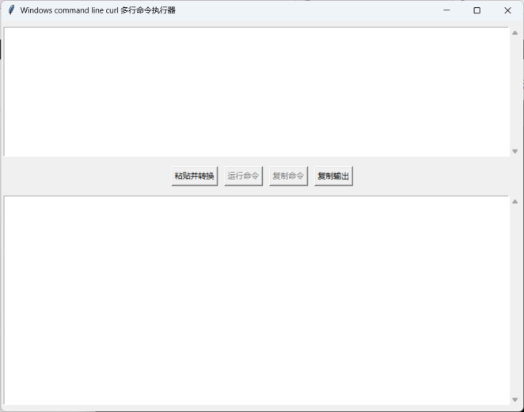

## pycurlcmd: 将 linux 的多行 Curl 命令转换为 Windows 格式并直接执行

**简介**

`curl`做为各种网络API的调试工具非常方便，技术网站上大多提供了多行 `curl` 命令，可直接在 `Linux` 或 `MacOS` 系统上执行。但由于Windows的多行命令格式的特点，把它们转换为 Windows 格式有点烦琐。

`pycurlcmd` 是一款用户友好的工具，旨在简化将多行 Linux curl 命令转换为 Windows 格式的过程。通过自动完成必要的语法更改，它消除了手动调整的麻烦，并可直接在Windows上执行 curl 命令，方便顺手。

**主要功能**

* **无缝转换:** 自动将 Linux curl 命令转换为其对应的 Windows 格式。
* **直观界面:** 提供简单易用的图形用户界面 (GUI)。

**如何使用**

1. **启动应用程序:** 确保在您的 Windows 机器上安装了`python`，使用 `python pycurlcmd.py` 启动。
2. **粘贴您的命令:** 先将 Linux curl 命令复制到粘贴板，点击`粘贴并转换`按钮即可将curl将命令转换并粘贴到输入框中。这时可在修改参数或各种key。
3. **运行命令:** 点击运行命令直接执行转换后的命令。如果`curl`命令不在路径中，也可在这一步指定`curl`的位置。

## pycurlcmd interface



**命令行示例**

* **Linux:** Bash

```
curl -X POST \
  https://api.example.com/v1/resource \
  -H "Content-Type: application/json" \
  -d '{"key":"value"}'
```

* **Windows (已转换):** DOS

```
curl -X POST ^
  https://api.example.com/v1/resource ^
  -H "Content-Type: application/json" ^
  -d "{\"key\":\"value\"}"
```

**关键转换更改**

* **换行符:** Linux 使用反斜杠 (\\) 表示续行，而 Windows 使用脱字符 (^)。
* **引号:** Windows命令行中不能使用单引号，而JSON串中也不能使用单引号。
* **编码:** 确保非 ASCII 字符的编码正确。

**故障排除**

* **输出不正确:** 检查原始 Linux 命令是否存在语法错误。
* **编码问题:** 确保您的终端或代码编辑器使用正确的编码。
* **命令执行错误:** 请参阅 curl 文档以获取特定错误消息。

**贡献**

我们欢迎您为改进 `pycurlcmd` 做出贡献。欢迎在我们的 GitHub 仓库上提交问题或拉取请求：[GitHub 仓库链接]

**许可证**

[指定代码发布许可证，例如 MIT、Apache]

通过遵循这些指南，您可以创建既信息丰富又对所有级别用户都友好的 README。

### 注意事项

* **依赖项:** 使用了tkinter库。确保tcl/tk安装正确

