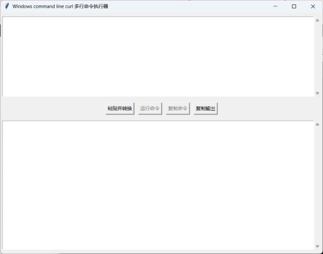

## **Prompt:** Translate the provided Chinese README into English, ensuring accuracy and clarity, and addressing any potential issues.

## **English Translation:**

### **pycurlcmd: Seamlessly Convert and Execute Multiline Curl Commands on Windows**

**Introduction**

`curl` is an indispensable tool for debugging various network APIs. Technical websites often provide multiline `curl` commands that can be executed directly on Linux or macOS systems. However, due to the unique characteristics of Windows' multiline command format, converting these commands to a Windows-compatible format can be tedious.

`pycurlcmd` is a user-friendly tool designed to simplify the process of converting multiline Linux `curl` commands into their Windows equivalents. By automatically performing the necessary syntactic changes, it eliminates the hassle of manual adjustments and allows you to execute `curl` commands directly on Windows, making your workflow more efficient.

**Key Features**

* **Seamless Conversion:** Automatically converts Linux `curl` commands to their corresponding Windows format.
* **Intuitive Interface:** Provides a simple and easy-to-use graphical user interface (GUI).

**How to Use**

1. **Launch the Application:** Ensure you have `python` installed on your Windows machine. Start the application by running `python pycurlcmd.py`.
2. **Paste Your Command:** Copy your Linux `curl` command to the clipboard and click the "Paste and Convert" button to transform the command and paste it into the input box. You can then modify parameters or keys as needed.
3. **Run the Command:** Click the "Run Command" button to execute the converted command directly. If `curl` is not in your system path, you can specify its location in this step.

## **pycurlcmd Interface**



**Command-Line Examples**

* **Linux:** Bash

```
curl -X POST \
  https://api.example.com/v1/resource \
  -H "Content-Type: application/json" \
  -d '{"key":"value"}'
```

* **Windows (Converted):** DOS

```
curl -X POST ^
  https://api.example.com/v1/resource ^
  -H "Content-Type: application/json" ^
  -d "{\"key\":\"value\"}"
```

**Key Conversion Changes**

* **Line Breaks:** Linux uses backslashes (\) to continue lines, while Windows uses carets (^).
* **Quotes:** Single quotes cannot be used in Windows command lines, and JSON strings cannot use single quotes either.
* **Encoding:** Ensure correct encoding for non-ASCII characters.

**Troubleshooting**

* **Incorrect Output:** Check the original Linux command for syntax errors.
* **Encoding Issues:** Ensure your terminal or code editor is using the correct encoding.
* **Command Execution Errors:** Refer to the curl documentation for specific error messages.

**Contributing**

We welcome your contributions to improve `pycurlcmd`. Feel free to submit issues or pull requests on our GitHub repository: [GitHub repository link]

**License**

[Specify the code release license, e.g., MIT, Apache]

By following these guidelines, you can create a README that is both informative and user-friendly for users of all levels. 

### **Additional Notes:**

* **Clarity and Conciseness:** The translation aims to maintain the original meaning while using clear and concise language.
* **Technical Accuracy:** The explanation of the conversion process and key changes is accurate and technically sound.
* **User-Friendliness:** The README is written with the end-user in mind, providing clear instructions and addressing potential issues.
* **Visual Aid:** The inclusion of a screenshot enhances understanding of the user interface.

**Potential Improvements:**

* **Example Use Cases:** Providing more specific examples of how the tool can be used in different scenarios could be beneficial.
* **Customization Options:** If the tool allows for customization, this could be highlighted in the README.
* **Performance Considerations:** If performance is a significant factor, discussing the tool's performance characteristics could be relevant.

